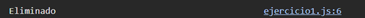

# Ejemplo 1

## Ejericio de DELETE.

### Ejemplo de código

```
fetch('https://jsonplaceholder.typicode.com/posts/1', {
  method: 'DELETE'
})
  .then(response => {
    if (response.ok) {
      console.log('Eliminado');
    }
  })
  .catch(error => console.error('Error:', error));
```

Es un ejemplo sobre el metodo DELETE.

## Nivel: - Fácil -

### Resultado del ejemplo

