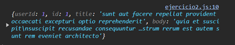

# Ejemplo 2

## Ejericio basico con GET.

### Ejemplo de código

```
fetch('https://jsonplaceholder.typicode.com/posts/1')
  .then(response => {
    if (!response.ok) {
      throw new Error('Error en la red');
    }
    return response.json();
  })
  .then(data => {
    console.log(data); 
  })
  .catch(error => {
    console.error('Error:', error);
  });
```

Es un ejemplo sencillo sobre el envio de datos mediante el GET.

## Nivel: - Fácil -

### Resultado del ejemplo

