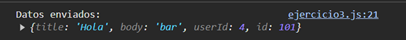

# Ejemplo 3

## Ejericio de Fetch con POST y manejo de errores.

### Ejemplo de código

```
const postData = {
    title: 'Hola',
    body: 'bar',
    userId: 4
  };
  
  fetch('https://jsonplaceholder.typicode.com/posts', {
    method: 'POST', 
    headers: {
      'Content-Type': 'application/json' 
    },
    body: JSON.stringify(postData) 
  })
    .then(response => {
      if (!response.ok) {
        throw new Error(`Error en la red: ${response.status}`);
      }
      return response.json(); 
    })
    .then(data => {
      console.log('Datos enviados:', data); 
    })
    .catch(error => {
      console.error('Error:', error); 
    });
```

Es un ejemplo sobre el envio de datos con POST y el manejo de errores.

## Nivel: - Fácil -

### Resultado del ejemplo

