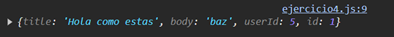

# Ejemplo 4

## Ejericio basico de PUT.

### Ejemplo de código

```
const updateData = { title: 'Hola como estas', body: 'baz', userId: 5 };

fetch('https://jsonplaceholder.typicode.com/posts/1', {
  method: 'PUT',
  headers: { 'Content-Type': 'application/json' },
  body: JSON.stringify(updateData)
})
  .then(response => response.json())
  .then(data => console.log(data))
  .catch(error => console.error('Error:', error));
```

Es un ejemplo basico del metodo PUT.

## Nivel: - Intermedio -

### Resultado del ejemplo

