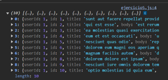

# Ejemplo 5

## Ejericio de parametros de consulta.

### Ejemplo de código

```
const userId = 1;
fetch(`https://jsonplaceholder.typicode.com/posts?userId=${userId}`)
  .then(response => response.json())
  .then(data => console.log(data))
  .catch(error => console.error('Error:', error));
```

Manejo de parametros de consulta.

## Nivel: - Intermedio -

### Resultado del ejemplo

