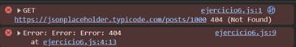

# Ejemplo 6

## Manejar errores de respuesta.

### Ejemplo de código

```
fetch('https://jsonplaceholder.typicode.com/posts/1000') 
  .then(response => {
    if (!response.ok) {
      throw new Error(`Error: ${response.status}`);
    }
    return response.json();
  })
  .then(data => console.log(data))
  .catch(error => console.error('Error:', error));
```

El código hace una solicitud fetch a una URL. Si la respuesta no es exitosa, lanza un error con el código de estado HTTP. Si la respuesta es correcta, convierte los datos a JSON y los imprime. Si hay un error, lo captura y muestra en la consola.

## Nivel: - Difícil -

### Resultado del ejemplo

