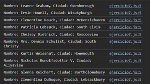

# Ejemplo 7

## Manejar respuestas anidadas.

### Ejemplo de código

```
fetch('https://jsonplaceholder.typicode.com/users')
  .then(response => response.json())
  .then(data => {
    data.forEach(user => {
      console.log(`Nombre: ${user.name}, Ciudad: ${user.address.city}`);
    });
  })
  .catch(error => console.error('Error:', error));
```

El código realiza una solicitud fetch a una API que devuelve una lista de usuarios. Convierte la respuesta en formato JSON y luego recorre los datos para imprimir el nombre y la ciudad de cada usuario. Si ocurre un error, lo captura y lo muestra en la consola.

## Nivel: - Difícil -

### Resultado del ejemplo

