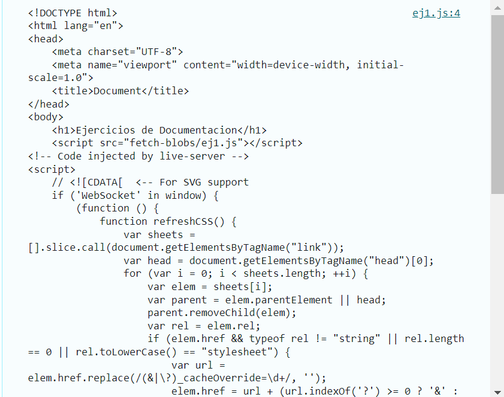

# Ejemplo 1

## En este ejemplo se debe tener un Blob y se debe de convertir a texto.

### Ejemplo de código
```
fetch('/index.text')
  .then(response => response.blob())
  .then(blob => blob.text())
  .then(text => console.log(text));
```
En este caso se le da un archivo y lo que hace es que lo convierte en un texto normal.

## Nivel: - Fácil -

### Resultado del ejemplo


Como se observa el blob que se le dio lo convirtio a un texto en general de lo que se tenia dentro del archivo.