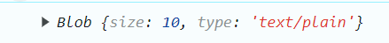

# Ejemplo 2

## Crearemos un Blob con datos locales.

### Ejemplo de código
```
const data = new Blob(['Hola Mundo'], { type: 'text/plain' });
console.log(data);
```
En este caso se crea un Blob, con datos locales que nosotros insertamos.

## Nivel: - Fácil -

### Resultado del ejemplo


Y podemos ver que como resultado obtenemos el tamaño y el tipo que se tiene.