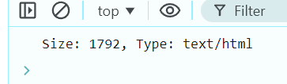

# Ejemplo 3

## Obtener tamaño y tipo de Blob.

### Ejemplo de código

```
fetch('file.txt')
  .then(response => response.blob())
  .then(blob => {
    console.log(`Size: ${blob.size}, Type: ${blob.type}`);
  });
```
En este ejmplo se le da un archivo para que pueda mostrar como resultado el tamaño y el tipo.

## Nivel: - Fácil -

### Resultado del ejemplo


Y podemos ver que como resultado nos arroja el tamaño del archivo y el tipo de texto que tiene dentro.