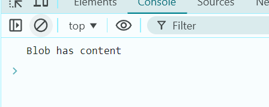

# Ejemplo 4

## Blob vacío.

### Ejemplo de código

```
fetch('file.txt')
  .then(response => response.blob())
  .then(blob => {
    console.log(blob.size === 0 ? 'Blob is empty' : 'Blob has content');
  });
```
En este ejmplo se le da un archivo para que el Blob pueda saber si el archivo esta vacío o tiene contenido.

## Nivel: - Intermedio -

### Resultado del ejemplo


Podemos observar que como se le ha dado un archivo con contenido, Blob lo detecta y manda un mensaje de que el Blob tiene contendio.