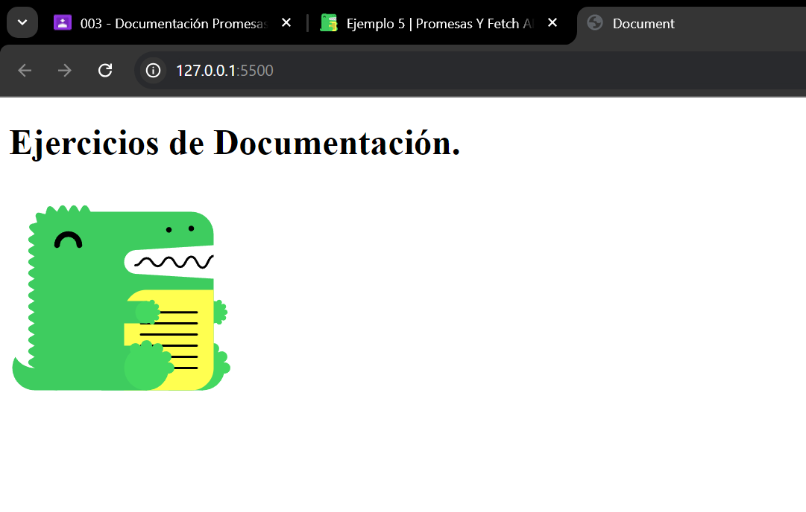

# Ejemplo 5

## Mostrar imagen.

### Ejemplo de código

```
fetch('image.png')
  .then(response => response.blob())
  .then(blob => {
    const url = URL.createObjectURL(blob);
    const img = document.createElement('img');
    img.src = url;
    document.body.appendChild(img);
  });
```
Con este ejemplo se busca leer un Blob de tipo imagen y lo muestre.

## Nivel: - Intermedio -

### Resultado del ejemplo


Podemos ver que obtiene el link de la imagen y lo muestra dentro del archivo.