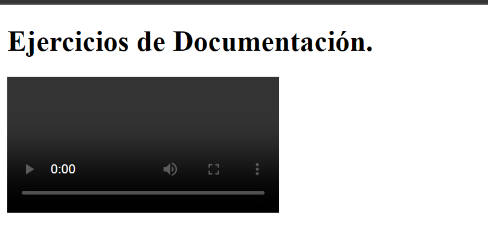

# Ejemplo 6

## Archivo de vídeo.

### Ejemplo de código

```
fetch('video.mp4')
  .then(response => response.blob())
  .then(blob => {
    const video = document.createElement('video');
    video.src = URL.createObjectURL(blob);
    video.controls = true;
    document.body.appendChild(video);
  });
```
Con este ejemplo se busca leer un Blob de tipo vídeo y lo pueda reproducir.

## Nivel: - Intermedio -

### Resultado del ejemplo


Como resultado podras obtener el video de tu enlace.