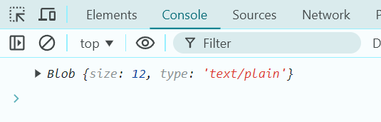

# Ejemplo 7

## Combinación de Blobs.

### Ejemplo de código

```
const blob1 = new Blob(['Hello'], { type: 'text/plain' });
const blob2 = new Blob(['World'], { type: 'text/plain' });

const combinedBlob = new Blob([blob1, blob2], { type: 'text/plain' });
console.log(combinedBlob);
```
Con este ejemplo se puede crear la unión de más de un Blob en uno solo.

## Nivel: - Difícil -

### Resultado del ejemplo


Nos muestra como resultado un solo Blob y sus especificaciones de tamaño y el tipo que es.