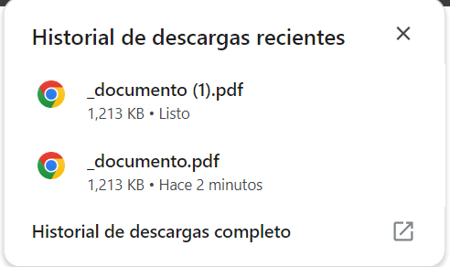

# Ejemplo 8

## Procesar un archivo PDF.

### Ejemplo de código

```
fetch('document.pdf')
  .then(response => response.blob())
  .then(blob => {
    const link = document.createElement('a');
    link.href = URL.createObjectURL(blob);
    link.download = 'document.pdf';
    link.click();
  });
```
Con este ejemplo se puede obtener una descarga del pdf.

## Nivel: - Difícil -

### Resultado del ejemplo


Se puede observar que se genero la descarga del archivo.