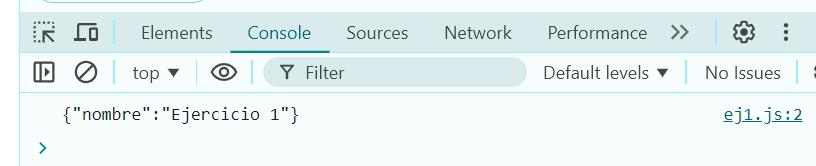

# Ejemplo 1

## Enviar un Objeto.

### Ejemplo de código

```
const data = { nombre: 'Ejercicio 1' };
console.log(JSON.stringify(data));
```
Con este ejemplo podemos hacer el envio de un objeto.

## Nivel: - Fácil -

### Resultado del ejemplo


Podemos notar que hace el envio del Objeto que esta dentro de data.