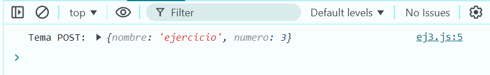

# Ejemplo 3

## Creación de un Objeto.

### Ejemplo de código

```
const ejemplo = {
    nombre: 'ejercicio',
    numero: 3,
  };
  console.log('Tema POST:', ejemplo);
```
Podemos ver la manera de crear un Objeto sencillo.

## Nivel: - Fácil -

### Resultado del ejemplo


Podemos ver que se crea el objeto que ingresamos.