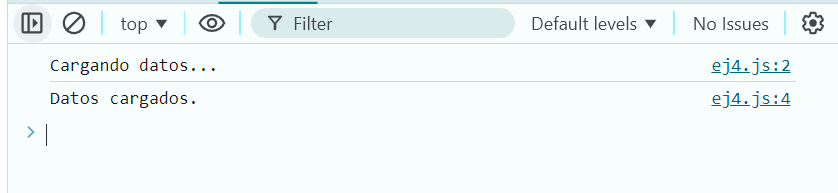

# Ejemplo 4

## Proceso de carga.

### Ejemplo de código

```
const simulateLoading = () => {
  console.log('Cargando datos...');
  setTimeout(() => {
    console.log('Datos cargados.');
  }, 2000);
};
simulateLoading();
```
Se puede ver la transicion de tiempo para la cargar de archivos. 

## Nivel: - Intermedio -

### Resultado del ejemplo


Tiene una transicion de 2 segundo para el cambio de cargando datos a datos cargados.