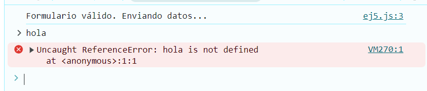

# Ejemplo 5

## Validación de datos.

### Ejemplo de código

```
const validarFormulario = (nombre) => {
  if (nombre) {
    console.log('Formulario válido. Enviando datos...');
  } else {
    console.log('Error: nombre es requerido.');
  }
};
validarFormulario('Juan');
```
Se tiene un ejemplo de formulario para hacer la validacion con un nombre.

## Nivel: - Intermedio -

### Resultado del ejemplo


Al momento de ingresar un dato erroneo no da la validacion.