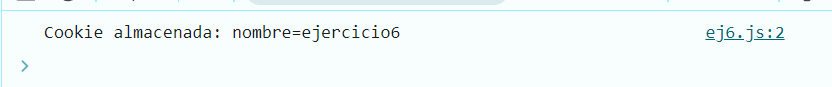

# Ejemplo 6

## Uso de Cookies.

### Ejemplo de código

```
document.cookie = "nombre=ejercicio6; path=/";
console.log('Cookie almacenada:', document.cookie);
```
Se genera una cookie de almacenamiento para el nombre.

## Nivel: - Intermedio -

### Resultado del ejemplo


Se muestra la cookie guardada.