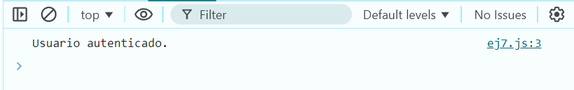

# Ejemplo 7

## Sistema de autenticación.

### Ejemplo de código

```
const autenticarUsuario = (usuario) => {
  if (usuario === 'Julian') {
    console.log('Usuario autenticado.');
  } else {
    console.log('Autenticación fallida.');
  }
};
autenticarUsuario('Julian');
```
Es un simulador de autenticación para usuarios.

## Nivel: - Difícil -

### Resultado del ejemplo


Como se puede ver que los nombres son iguales arroja un mensaje de autenticación.