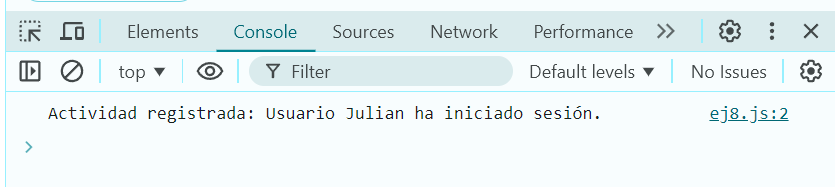

# Ejemplo 8

## Sistema de registro de actividad.

### Ejemplo de código

```
const logActividades = (actividad) => {
  console.log('Actividad registrada:', actividad);
};
logActividades('Usuario Julian ha iniciado sesión.');
```
Es un simulador para almacenar el registro de actividad, como este de inicio de sesión.

## Nivel: - Difícil -

### Resultado del ejemplo


Se muestra la actividad que se hizo.