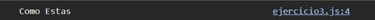

# Ejemplo 3

## Cadena de texto.

### Ejemplo de código

```
const append = (str) => Promise.resolve(str);
append('Como')
  .then(result => result + ' Estas')
  .then(result => console.log(result)); 
```

Se crea una cadena de texto, para un saludo.

## Nivel: - Fácil -

### Resultado del ejemplo
