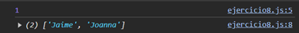

# Ejemplo 8

## Flujo de promesas.

### Ejemplo de código

```
const getUser = () => Promise.resolve({ id: 1 });
const getPosts = () => Promise.resolve(['Jaime', 'Joanna']);
getUser()
  .then(user => {
    console.log(user.id);
    return getPosts();
  })
  .then(posts => console.log(posts)); 
```

Se hace funcion del posts para darle mayor flujo a las promesas.

## Nivel: - Difícil -

### Resultado del ejemplo
