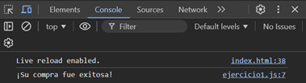

# Ejemplo 1

## Promesa Simple.

### Ejemplo de código

```
const promise = new Promise((resolve, reject) => {
  setTimeout(() => {
    resolve('¡Su compra fue exitosa!');
  }, 1000);
});

promise.then(result => console.log(result));
```

Es un ejemplo de una promesa simple.

## Nivel: - Fácil -

### Resultado del ejemplo
