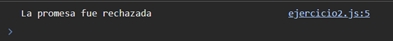

# Ejemplo 2

## Promesa Rechazada.

### Ejemplo de código

```
const rejectedPromise = new Promise((resolve, reject) => {
    reject('La promesa fue rechazada');
  });
  
  rejectedPromise.catch(error => console.log(error)); 
```

Ejemplo de como seria una promesa que no se cumple y por lo tanto queda rechazada.

## Nivel: - Fácil -

### Resultado del ejemplo
