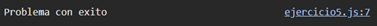

# Ejemplo 5

## Promesa con exito o error.

### Ejemplo de código

```
const promise = new Promise((resolve, reject) => {
    const success = true;
    success ? resolve('Problema con exito') : reject('Problema con fallas');
  });
  
  promise
    .then(result => console.log(result))
    .catch(error => console.log(error));
```

Es un ejemplo de un promesa que si se realiza con exito muestra un mensaje en la consola, si no muestra el error.

## Nivel: - Intermedio -

### Resultado del ejemplo


Se puede ver que la promesa se realizo con exito.