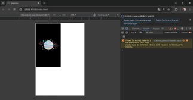

# Ejemplo 7

## Cargar una imagen.

### Ejemplo de código

```
const cargarImagen = (url) => {
    return new Promise((resolve, reject) => {
      const img = new Image();
      img.onload = () => resolve(img);
      img.onerror = () => reject('La imagen no se pudo cargar');
      img.src = url;
    });
  };
  
  cargarImagen('https://www.google.com/url?sa=i&url=https%3A%2F%2Fwww.lavanguardia.com%2Fandro4all%2Ffondos-de-pantalla%2Fmejores-fondos-pantalla-para-movil&psig=AOvVaw3-PU3uGVkinl434UgTEjgL&ust=1728847493988000&source=images&cd=vfe&opi=89978449&ved=0CBQQjRxqFwoTCOiBk4DJiYkDFQAAAAAdAAAAABAE')
    .then((img) => document.body.appendChild(img))
    .catch((error) => console.log(error));
```

Es un ejemplo donde se sube una imagen.

## Nivel: - Difícil -

### Resultado del ejemplo


Se puede ver que la imagen si fue cargada.