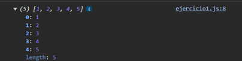

# Ejemplo 1

## Promesa Simple.

### Ejemplo de código

```
const promise1 = Promise.resolve(1);
const promise2 = Promise.resolve(2);
const promise3 = Promise.resolve(3);
const promise4 = Promise.resolve(4);
const promise5 = Promise.resolve(5);

Promise.all([promise1, promise2, promise3, promise4, promise5]).then((values) => {
    console.log(values);
});
```

Es un ejemplo de promesa simple.

## Nivel: - Fácil -

### Resultado del ejemplo
