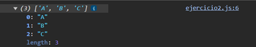

# Ejemplo 2

## Promesa con Retardos.

### Ejemplo de código

```
const promise1 = new Promise((resolve) => setTimeout(() => resolve('A')));
const promise2 = new Promise((resolve) => setTimeout(() => resolve('B')));
const promise3 = new Promise((resolve) => setTimeout(() => resolve('C')));

Promise.all([promise1, promise2, promise3]).then((values) => {
    console.log(values); 
});
```

Es un ejemplo con retardos en cada promesa.

## Nivel: - Fácil -

### Resultado del ejemplo
