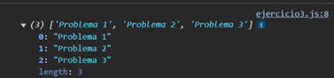

# Ejemplo 3

## Multiples promesas.

### Ejemplo de código

```
const promises = [
    new Promise((resolve) => setTimeout(() => resolve('Problema 1'))),
    new Promise((resolve) => setTimeout(() => resolve('Problema 2'))),
    new Promise((resolve) => setTimeout(() => resolve('Problema 3'))),
];

Promise.all(promises).then((values) => {
    console.log(values); 
});
```

Se puede ver un ejemplo que contiene mas de una promesa.

## Nivel: - Fácil -

### Resultado del ejemplo
