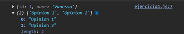

# Ejemplo 4

## Dependencia de promesas.

### Ejemplo de código

```
const fetchUser = () => Promise.resolve({ id: 1, name: 'Vanessa' });
const fetchPosts = (userId) => Promise.resolve(['Opinion 1', 'Opinion 2']);

Promise.all([fetchUser(), fetchPosts(1)]).then((results) => {
    const user = results[0];
    const posts = results[1];
    console.log(user, posts); 
});
```

Es un ejemplo de una promesa que contiene dependencias.

## Nivel: - Intermedio -

### Resultado del ejemplo

