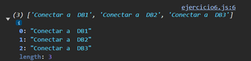

# Ejemplo 6

## Uso de Promise.all para inicializar múltiples conexiones

### Ejemplo de código

```
const connectToDB = (db) => new Promise((resolve) => {
    setTimeout(() => resolve(`Conectar a  ${db}`), Math.random() * 1000);
});

Promise.all(['DB1', 'DB2', 'DB3'].map(db => connectToDB(db))).then((results) => {
    console.log(results);
});
```

Es un ejemplo del uso de promise.all para poder realizar mas de una conexion.

## Nivel: - Intermedio -

### Resultado del ejemplo

