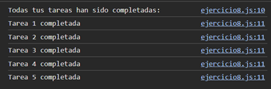

# Ejemplo 8

## Implementación de una cola de tareas con Promise.all

### Ejemplo de código

```
const tasks = [1, 2, 3, 4, 5].map((num) => {
    return new Promise((resolve) => {
        setTimeout(() => {
            resolve(`Tarea ${num} completada`); 
        }, Math.random() * 2000);
    });
});

Promise.all(tasks).then((results) => {
    console.log('Todas tus tareas han sido completadas:'); 
    results.forEach(result => console.log(result));
});
```

Este código en JavaScript crea un array de promesas a partir de una lista de números, donde cada promesa simula la finalización de una tarea con un tiempo de espera aleatorio. Luego, usa Promise.all() para esperar que todas las tareas terminen. 

## Nivel: - Difícil -

### Resultado del ejemplo

