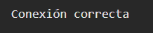

# Ejemplo 8

## Simulación de conexión.

### Ejemplo de código

```
const conexionCorrecta = new Promise((resolve) => {
    setTimeout(() => resolve("Conexión correcta"));
});

const conexionError = new Promise((_, reject) => {
    setTimeout(() => reject("Conexión de error"));
});

Promise.race([conexionCorrecta, conexionError])
    .then(console.log)
    .catch(console.error);
```

El código ejecuta dos promesas que simulan una conexión exitosa y una fallida, y usa Promise.race() para devolver el resultado de la que termine primero. Si se resuelve bien, muestra "Conexión correcta"; si falla primero, muestra "Conexión de error".

## Nivel: - Difícil -

### Resultado del ejemplo
